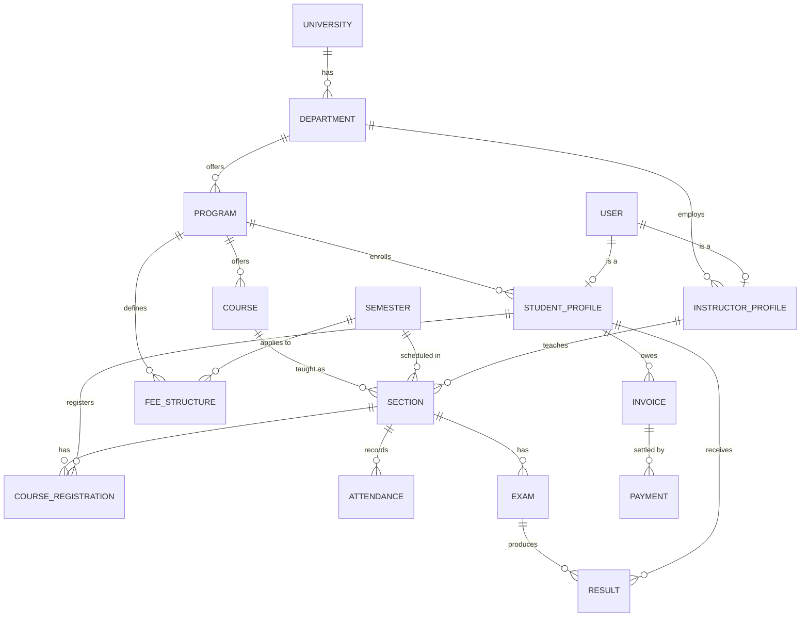

# 🎓 CloudVarsity — University Management System API

A production-grade, backend-only REST API for managing a university's full academic
lifecycle — from admission and course registration to attendance, results, GPA,
tuition payments, and administrative oversight.

Built as a solo backend engineering project to demonstrate real-world backend
concerns: role-based access control, transaction-safe concurrency handling,
third-party payment gateway integration, and a clean, layered architecture.


---

## 🔗 Live API

**Base URL:** `https://cloud-varsity.vercel.app/api/v1`

> This is a backend-only project — no frontend UI. All functionality is meant to be
> exercised through the Postman collection linked below.

---

## 📋 Table of Contents

- [Overview](#-overview)
- [Tech Stack](#-tech-stack)
- [User Roles](#-user-roles--permissions)
- [Key Features & Engineering Highlights](#-key-features--engineering-highlights)
- [Database Design](#-database-design)
- [Project Structure](#-project-structure)
- [API Documentation](#-api-documentation)
- [Getting Started](#-getting-started)
- [Environment Variables](#-environment-variables)
- [Design Decisions & Trade-offs](#-design-decisions--trade-offs)
- [Deployment](#-deployment)
- [Author](#-author)

---

## 🧭 Overview

CloudVarsity models a real university's operations end to end:

```
University → Department → Program → Course → Semester → Section
    → Course Registration → Attendance → Exam → Result → GPA → Transcript
```

alongside the supporting systems every real university backend needs: authentication,
tuition invoicing and online payment, notifications, and administrative audit trails.

## 🛠️ Tech Stack

| Layer                    | Technology                                                                  |
| ------------------------ | --------------------------------------------------------------------------- |
| Runtime & Framework      | Node.js, TypeScript, Express.js                                             |
| Database & ORM           | PostgreSQL, Prisma (multi-file schema, driver adapters)                     |
| Validation               | Zod                                                                         |
| Auth                     | Custom JWT (access + refresh), bcrypt, Google OAuth (`google-auth-library`) |
| Caching / Ephemeral Data | Redis (OTP storage, response caching, rate limiting)                        |
| Payments                 | SSLCommerz (`sslcommerz-lts`)                                               |
| Email                    | Nodemailer + EJS templates                                                  |
| File Storage             | Cloudinary + Multer                                                         |
| Security                 | Helmet, `express-rate-limit`, CORS                                          |
| Linting/Formatting       | Biome                                                                       |
| Deployment               | Vercel Serverless Functions                                                 |

## 👥 User Roles & Permissions

The system enforces strict RBAC across **6 roles**:

| Role               | Scope                                                                                   |
| ------------------ | --------------------------------------------------------------------------------------- |
| `STUDENT`          | Self-service: register/drop courses, view attendance, results, transcript, pay invoices |
| `INSTRUCTOR`       | Manage their own assigned sections: mark attendance, create exams, submit results       |
| `DEPARTMENT_ADMIN` | Manage programs, courses, and sections **within their own department only**             |
| `REGISTRAR`        | Manage semesters, publish results, monitor registrations university-wide                |
| `FINANCE_ADMIN`    | Manage fee structures, generate invoices, track payments                                |
| `SUPER_ADMIN`      | Full system access: user management, dashboard stats, audit logs                        |

Authorization is enforced with a reusable `auth(...roles)` middleware, and every
protected endpoint re-validates the user's active status against the database on
each request (not just the JWT payload) — so a deactivated account loses access
immediately, without waiting for its token to expire.

## ⭐ Key Features & Engineering Highlights

- ✅ JWT auth (Bearer access token + httpOnly-cookie refresh token) + Google Social Login
- ✅ OTP-based forgot/reset password flow, backed by Redis TTL (no extra DB table, no cleanup job)
- ✅ **Race-condition-safe course registration** using `SELECT ... FOR UPDATE` row locking to prevent seat over-booking under concurrent requests
- ✅ Prerequisite validation, add/drop, and seat-capacity enforcement
- ✅ Bulk attendance marking with per-student summaries
- ✅ Weighted grading engine (Quiz/Assignment/Midterm/Final) with automatic GPA and semester-wise transcript generation — no data duplication, everything derived from source records
- ✅ Full SSLCommerz payment integration with **server-side transaction validation** (never trusts client callbacks blindly) and idempotent webhook handling
- ✅ Soft deletes, pagination, filtering, and search across all list endpoints
- ✅ Audit logging for sensitive actions (status changes, result publishing, payments)
- ✅ Branded transactional emails (EJS) for registration, payments, results, and account status changes
- ✅ Rate limiting, Helmet security headers, Redis-backed response caching
- ✅ Consistent `{ success, statusCode, message, data/errors }` response contract on every endpoint

## 🗄️ Database Design

19 models across 9 domains (accounts, academics, enrollment, attendance,
examinations, results, finance, notifications, audit), modeled with Prisma's
multi-file schema. Core relationships:



Notably, there is **no separate GPA or Transcript table** — both are computed on
demand from `Result` and `CourseRegistration` records (with CGPA cached on
`StudentProfile` for read performance), avoiding data that could drift out of sync.

## 📁 Project Structure

```
src/
├── app.ts                     # Express app, middleware wiring, route mounting
├── server.ts                  # Entry point: DB/Redis/SMTP connections, seeding, listen
└── app/
    ├── config/                # Centralized environment configuration
    ├── lib/                   # Third-party client singletons (Prisma, Redis, Nodemailer, Cloudinary, SSLCommerz)
    ├── middleware/             # checkAuth (RBAC), validateRequest, rateLimiter, error handlers
    ├── utils/                  # AppError, sendResponse, catchAsync, jwt, grading, shared helpers
    ├── templates/               # EJS email templates
    └── module/
        ├── auth/               # Register, login, tokens, Google login, password reset
        ├── user/                # Profile management, admin user management
        ├── academics/           # University, Department, Program, Course, Semester, Section
        ├── examination/        # Exam CRUD
        ├── result/              # Result submission, publishing, GPA, transcript
        ├── enrollment/          # Course registration (with row-locking)
        ├── attendance/          # Attendance marking & summaries
        ├── finance/             # Fee structures, SSLCommerz payments, invoices
        ├── notification/        # In-app + email notifications
        ├── admin/               # Dashboard stats, audit logs
        └── report/              # Enrollment/attendance/result/finance reports

prisma/
└── schema/                    # Multi-file Prisma schema (one file per domain)
```

## 📬 API Documentation

A complete Postman collection (66 requests across 17 modules) is included, with:

- Auto-captured variables — running "Create Department" automatically saves its
  `id` for the next request that needs it (no manual copy-pasting IDs)
- Built-in status-code assertions on every request (doubles as a regression test suite)
- A "Quick Role Logins" folder for fast switching between all 6 roles

📎 **Postman Collection:** `docs/CloudVarsity.postman_collection.json`
📎 **Environments:** `docs/CloudVarsity.local.postman_environment.json` · `docs/CloudVarsity.production.postman_environment.json`

All responses follow one consistent contract:

```jsonc
// Success
{ "success": true, "statusCode": 200, "message": "...", "data": { } }

// Error
{ "success": false, "statusCode": 400, "message": "...", "errors": [{ "message": "..." }] }
```

## 🚀 Getting Started

### Prerequisites

- Node.js 20+
- PostgreSQL 16+
- Redis
- A [SSLCommerz sandbox](https://developer.sslcommerz.com/registration/) account (for payment testing)

### Installation

```bash
git clone https://github.com/Sahidulislam05/Cloud-Varsity
cd Cloud-Varsity
npm install
```

### Setup

```bash
cp .env.example .env
# fill in .env with your own values — see "Environment Variables" below

npx prisma generate
npx prisma migrate dev

npm run dev
```

The server seeds a default university and demo accounts for every role on first
boot (see [Demo Credentials](#-demo-credentials)).

## 🔐 Environment Variables

> Treat this as a reference — always cross-check the exact key names against your
> own `.env.example`, since these are grouped by purpose here for readability.

| Category           | Variables                                                                                                                             |
| ------------------ | ------------------------------------------------------------------------------------------------------------------------------------- |
| Server             | `PORT`, `NODE_ENV`, `FRONTEND_URL`, `BACKEND_URL`                                                                                     |
| Database           | `DATABASE_URL`                                                                                                                        |
| Redis              | `REDIS_URL` (or host/port/password, depending on your setup)                                                                          |
| JWT                | `JWT_ACCESS_SECRET`, `JWT_ACCESS_EXPIRES_IN`, `JWT_REFRESH_SECRET`, `JWT_REFRESH_EXPIRES_IN`                                          |
| Password Hashing   | `BCRYPT_SALT_ROUNDS`                                                                                                                  |
| Google OAuth       | `GOOGLE_CLIENT_ID`                                                                                                                    |
| Email (Nodemailer) | SMTP host/port/user/pass, `EMAIL_SENDER`                                                                                              |
| File Storage       | `CLOUDINARY_CLOUD_NAME`, `CLOUDINARY_API_KEY`, `CLOUDINARY_API_SECRET`                                                                |
| Payments           | `SSL_COMMERZ_STORE_ID`, `SSL_COMMERZ_STORE_PASSWD`, `SSL_COMMERZ_IS_LIVE`                                                             |
| Seed Accounts      | `SUPER_ADMIN_*`, `DEPARTMENT_ADMIN_*`, `REGISTRAR_*`, `FINANCE_ADMIN_*`, `INSTRUCTOR_ADMIN_*`, `STUDENT_*` (name/email/password each) |

## 🧠 Design Decisions & Trade-offs

A few decisions worth knowing before an interview — because "it works" is a much
weaker answer than "it works, and here's why I built it this way":

- **Row-level locking over optimistic checks for enrollment** — `SELECT ... FOR
UPDATE` inside a transaction guarantees a section can never be over-booked
  under concurrent registration attempts, at the cost of a brief lock held only
  around the capacity check itself (kept as short as possible for throughput).
- **Bearer token + httpOnly cookie hybrid** — access tokens are sent as
  `Authorization: Bearer` headers per the assignment's requirement, while refresh
  tokens live in an httpOnly cookie so they're inaccessible to client-side
  JavaScript (XSS mitigation).
- **No stored GPA history / Transcript table** — GPA and transcripts are derived
  from `Result` + `CourseRegistration` on read, avoiding a second source of truth
  that could drift from the underlying data. Only the current CGPA is cached on
  `StudentProfile`, refreshed after every result publish.
- **Soft deletes only where a DELETE endpoint exists** — applied to `User`,
  `Department`, `Program`, `Course`, and `Section`; not applied blanket-wide, to
  avoid unnecessary query complexity on models that are never deleted.
- **Audit logging is selective, not exhaustive** — only actions that are
  irreversible, financial, permission-changing, or affect many users at once are
  logged (status changes, result publishing, payments), keeping the log
  meaningful instead of noisy.
- **Payment validation never trusts the callback body** — every successful
  payment is re-verified against SSLCommerz's own Validation API before the
  invoice is marked paid, and `completePayment` is idempotent so both the
  browser redirect and the server-to-server IPN can safely call it.
- **In-memory rate limiting, documented limitation** — `express-rate-limit`'s
  default store doesn't share state across serverless instances on Vercel; a
  Redis-backed store (`rate-limit-redis`) would fix this in a larger deployment,
  but was left out here to avoid adding a hard dependency on Redis for a
  security feature that should fail safe.

## ☁️ Deployment

Deployed on **Vercel Serverless Functions**.

**Live API:** [`https://cloud-varsity.vercel.app`](https://cloud-varsity.vercel.app)

## 👤 Author

**Sahidul Islam**
Full-Stack Developer, Dhaka, Bangladesh

---
