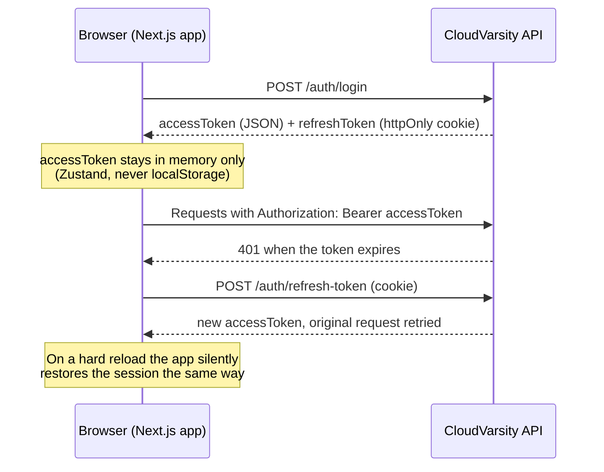

# 🎓 CloudVarsity — University Management System

A responsive, role-based web application for running a university end to end: course registration, attendance,
exams, results and GPA, tuition invoices and online payments, plus the administrative tools behind them.

It is the frontend of the CloudVarsity platform and consumes the [CloudVarsity REST API](https://cloud-varsity.vercel.app).
Six roles, six purpose-built dashboards, one consistent design system.


---

## 🔗 Live Links

|                        |                                                        |
| ---------------------- | ------------------------------------------------------ |
| **Frontend (live)**    | https://cloud-varsity-bd.vercel.app                    |
| **Backend API (live)** | https://cloud-varsity.vercel.app                       |
| **API base path**      | `https://cloud-varsity.vercel.app/api/v1`              |
| **Backend repository** | https://github.com/Sahidulislam05/Cloud-Varsity        |
| **API documentation**  | Postman collection in the backend repository (`docs/`) |

## 📋 Table of Contents

- [Features](#-features)
- [Pages & Routes](#-pages--routes)
- [Tech Stack](#-tech-stack)
- [Architecture](#-architecture)
- [Design System](#-design-system)
- [Accessibility & Performance](#-accessibility--performance)
- [Project Structure](#-project-structure)
- [Getting Started](#-getting-started)
- [Environment Variables](#-environment-variables)
- [Deployment](#-deployment)
- [Try the Full Flow](#-try-the-full-flow)
- [Known Limitations](#-known-limitations)
- [Assignment Checklist](#-assignment-checklist)
- [Author](#-author)

---

## ✨ Features

### Public website

- Animated landing page with nine sections: live statistics, features, programs, how it works, roles, latest courses,
  security, FAQ and a final call to action
- Program and course catalog with **search, filter, sort and pagination synchronised to the URL**
  (bookmarkable, shareable, Back-button friendly)
- About, Services and a Contact form that really sends an email through the API
- Server-rendered, with per-page metadata, Open Graph tags, a sitemap and `robots.txt`

### Authentication

- Email and password login, student self-registration with a program picker
- **One-click Demo Login for all six roles**
- Silent session restore on reload, automatic token refresh, role-aware redirects

### Six dashboards

| Role                 | What they do                                                                                                                                                                              |
| -------------------- | ----------------------------------------------------------------------------------------------------------------------------------------------------------------------------------------- |
| **Student**          | Browse and register for course sections (live seats, prerequisites), drop courses, see exams, results, attendance and transcript with CGPA, pay invoices through SSLCommerz, edit profile |
| **Instructor**       | See assigned sections and rosters, take attendance for a whole class at once, create exams and submit marks through a **three-step wizard**                                               |
| **Department Admin** | Department overview, program and course management (with prerequisites), section creation with instructor assignment, scoped to their own department                                      |
| **Registrar**        | Create semesters and move them through their lifecycle, monitor every registration, publish final results                                                                                 |
| **Finance Admin**    | Fee structures, bulk invoice generation, invoice tracking, payment reports with charts                                                                                                    |
| **Super Admin**      | System overview with charts, user management (activate or deactivate), full course CRUD, audit log and four reports                                                                       |

### Cross-cutting

- Reusable `DataTable`, `StatCard`, `StatusBadge`, `ConfirmDialog`, `Stepper`, URL-synced `SearchInput`,
  `FilterSelect` and `Pagination`
- Loading skeletons, empty states and error states with retry on every data-driven view
- Toast feedback for every success and failure
- Fully responsive, from 320 px phones to wide desktops

---

## 🗺️ Pages & Routes

**29 routes**, plus a custom 404 page and a global error boundary.

| Area                 | Routes                                                                                                  |
| -------------------- | ------------------------------------------------------------------------------------------------------- |
| Public (5)           | `/` · `/about` · `/services` · `/programs` · `/contact`                                                 |
| Auth (2)             | `/login` · `/register`                                                                                  |
| Payment (2)          | `/payment/success` · `/payment/cancel`                                                                  |
| Student (3)          | `/student` · `/student/payments` · `/student/profile`                                                   |
| Instructor (4)       | `/instructor` · `/instructor/sections/[id]` · `/instructor/sections/[id]/grade` · `/instructor/profile` |
| Department Admin (3) | `/department-admin` · `/department-admin/courses` · `/department-admin/sections`                        |
| Registrar (3)        | `/registrar` · `/registrar/registrations` · `/registrar/results`                                        |
| Finance Admin (3)    | `/finance-admin` · `/finance-admin/invoices` · `/finance-admin/reports`                                 |
| Super Admin (4)      | `/super-admin` · `/super-admin/users` · `/super-admin/courses` · `/super-admin/reports`                 |

---

## 🛠️ Tech Stack

| Category           | Technology                                                               |
| ------------------ | ------------------------------------------------------------------------ |
| Framework          | Next.js 16 (App Router, Turbopack), React 19                             |
| Language           | TypeScript (strict, no `any`)                                            |
| Styling & UI       | Tailwind CSS 4, shadcn/ui (`radix-lyra` style) on Radix UI, Lucide icons |
| Server state       | TanStack Query 5                                                         |
| Client state       | Zustand (session only)                                                   |
| HTTP               | Axios with interceptors (auth header, silent token refresh)              |
| Forms & validation | React Hook Form + Zod 4                                                  |
| Charts             | Recharts 3                                                               |
| Notifications      | Sonner                                                                   |
| Payments           | SSLCommerz (sandbox) via the API                                         |
| Tooling            | Biome (lint and format), Bun                                             |
| Deployment         | Vercel                                                                   |

---

## 🏗️ Architecture

### Rendering model

| Surface      | Strategy                                                                        | Why                                                                |
| ------------ | ------------------------------------------------------------------------------- | ------------------------------------------------------------------ |
| Public pages | **Server Components** that fetch from the API with `revalidate` caching         | Fast first paint and SEO                                           |
| Dashboards   | **Client Components** using TanStack Query                                      | Requests need the access token, which lives only in browser memory |
| Page files   | Server Components that only set metadata and wrap a client view in `<Suspense>` | Keeps the server and client boundary small and explicit            |

### Authentication and authorisation


```mermaid
sequenceDiagram
    participant B as Browser (Next.js app)
    participant A as CloudVarsity API
    B->>A: POST /auth/login
    A-->>B: accessToken (JSON) + refreshToken (httpOnly cookie)
    Note over B: accessToken stays in memory only<br/>(Zustand, never localStorage)
    B->>A: Requests with Authorization: Bearer accessToken
    A-->>B: 401 when the token expires
    B->>A: POST /auth/refresh-token (cookie)
    A-->>B: new accessToken, original request retried
    Note over B: On a hard reload the app silently<br/>restores the session the same way
```

- **Access token in memory, refresh token in an httpOnly cookie.** JavaScript can never read the refresh token, which
  limits the damage of an XSS bug
- A single in-flight refresh is shared by concurrent requests, so a burst of expired calls triggers one refresh
- `src/proxy.ts` (Next.js 16's replacement for `middleware.ts`) uses a small first-party **hint cookie** that holds the
  role name only, to redirect quickly. It is a UX convenience and **not** a security boundary
- The real checks are the API, which verifies the token and the account status on every request, and the dashboard
  shell, which compares the URL with the verified user's role
- Sensitive actions are never decided on the client: seat limits, prerequisites, role scopes and payment verification
  all live in the API

### Data fetching and URL state

- Search, filters, sort, tabs and pagination are stored in the **URL** (`?search=&status=&page=2`), so every view can
  be bookmarked, shared and restored with the Back button
- Search input is debounced; lists keep the previous rows visible while the next page loads (`keepPreviousData`)
- Mutations invalidate related queries by key prefix, so every table and counter refreshes itself

### Forms

All forms use React Hook Form with a Zod schema whose rules mirror the API's own validation. Server-side field errors
are mapped back onto the exact input, and a field-less error falls back to a toast.

### Payments (SSLCommerz)

1. The student presses **Pay now**, the API creates a payment session and returns the gateway URL
2. The browser goes to SSLCommerz and pays with a sandbox card
3. SSLCommerz calls the API, which **re-verifies the payment with the gateway** before marking the invoice paid
4. The API redirects the browser to `/payment/success` or `/payment/cancel`
5. The success page never trusts the URL: it loads the student's own payment record and shows the **real** status

---

## 🎨 Design System

Colour choices follow a Brand → Industry → Audience → Emotion → User action chain, defined as OKLCH tokens in
`globals.css`.

| Token                        | Role                       | Reasoning                                                                                                                                                                                     |
| ---------------------------- | -------------------------- | --------------------------------------------------------------------------------------------------------------------------------------------------------------------------------------------- |
| **Primary blue**             | Main actions, links        | Blue signals trust and calm authority, the norm in education and finance software                                                                                                             |
| **Brand violet**             | Gradients, premium moments | Pairs with blue and matches the transactional emails from the API                                                                                                                             |
| **Success / Warning / Info** | Status badges, charts      | Emerald, amber and sky are recognised instantly. Red is reserved for destructive actions and real failures so it never causes needless anxiety                                                |
| **Role accents**             | Sidebar and badges only    | Student blue, instructor teal, department indigo, registrar purple, finance emerald, super admin violet. A small wayfinding cue rather than six different themes, so the app stays consistent |

- shadcn **`radix-lyra`** style: sharp corners and compact type, used consistently across custom components
- Inter for text, Geist Mono for IDs and transaction numbers
- Status is always conveyed by text as well as colour

---

## ♿ Accessibility & Performance

**Accessibility**

- "Skip to main content" link, proper landmarks and a single `h1` per page
- Every input has a label, `aria-invalid` and `aria-describedby`. Errors use `role="alert"`
- Radix primitives for dialogs, sheets, selects and menus: focus trapping, Esc to close, full keyboard support
- `aria-current` on navigation, captions on tables, accessible names on icon-only buttons
- Respects `prefers-reduced-motion`: scroll reveals, count-up numbers and floating shapes switch off
- The FAQ uses native `<details>`, so it works without JavaScript

**Performance**

- Server Components and ISR-style revalidation for public pages
- Route-level code splitting, skeleton loaders (`loading.tsx` plus per-table skeletons)
- Debounced search, previous-data placeholders, cached queries with sensible stale times
- Icons only (no raster images), tree-shaken Lucide imports

---

## 📁 Project Structure

```
src/
├── app/
│   ├── (public)/            # Home, About, Services, Programs, Contact
│   ├── (auth)/              # Login, Register
│   ├── (dashboard)/         # student · instructor · department-admin · registrar · finance-admin · super-admin
│   ├── payment/             # success · cancel
│   ├── not-found.tsx  error.tsx  sitemap.ts  robots.ts
│   └── layout.tsx  providers.tsx
├── components/
│   ├── ui/                  # shadcn/ui primitives
│   ├── shared/              # DataTable, StatCard, StatusBadge, ConfirmDialog, Stepper, Pagination, ...
│   ├── dashboard/           # shell, sidebar, user menu
│   ├── home/  public/  auth/  payment/
│   └── student/  instructor/  department-admin/  registrar/  finance-admin/  super-admin/
├── config/                  # navigation per role, site content, sort options
├── hooks/                   # use-list-query, use-pagination, use-debounce, feature hooks
├── lib/                     # api-client, server-api, validations, formatters, helpers
├── providers/               # query + auth providers
├── store/                   # Zustand session store
├── types/
└── proxy.ts                 # route hints (Next.js 16 proxy)
```

---

## 🚀 Getting Started

### Prerequisites

- [Bun](https://bun.sh) 1.x (recommended) or Node.js 20.9+
- A running CloudVarsity API (the live one works out of the box)

### Install and run

```bash
git clone https://github.com/Sahidulislam05/cloud-versity.git
cd cloud-versity
bun install

cp .env.example .env.local      # then fill in the values below
bun run dev
```

Open http://localhost:3000.

### Scripts

| Command                | Purpose                             |
| ---------------------- | ----------------------------------- |
| `bun run dev`          | Start the development server        |
| `bun run build`        | Production build (also type-checks) |
| `bun run start`        | Serve the production build          |
| `bunx biome check src` | Lint and format check               |

---

## 🔐 Environment Variables

Create `.env.local` (never commit it).

| Variable                           | Description                                                                   | Example                                   |
| ---------------------------------- | ----------------------------------------------------------------------------- | ----------------------------------------- |
| `NEXT_PUBLIC_API_URL`              | API base URL, including `/api/v1`                                             | `https://cloud-varsity.vercel.app/api/v1` |
| `NEXT_PUBLIC_SITE_URL`             | Public URL of this site, used for canonical links, Open Graph and the sitemap | `https://cloud-varsity-bd.vercel.app`     |
| `NEXT_PUBLIC_DEMO_<ROLE>_EMAIL`    | Email used by that role's **Demo Login** button                               | provided by the maintainer                |
| `NEXT_PUBLIC_DEMO_<ROLE>_PASSWORD` | Password used by that role's **Demo Login** button                            | provided by the maintainer                |

`<ROLE>` is each of `STUDENT`, `INSTRUCTOR`, `DEPARTMENT_ADMIN`, `REGISTRAR`, `FINANCE_ADMIN` and `SUPER_ADMIN`.

> `NEXT_PUBLIC_` values are bundled into the browser, so the demo variables must point to **dedicated demo accounts**
> with demo-only passwords, never to real accounts. A role whose variables are missing simply has its Demo Login
> button disabled.

---

## ☁️ Deployment

Deployed on **Vercel**.

1. Import the repository in Vercel
2. Add the environment variables above
3. Deploy

The API must be configured for this frontend:

| API setting          | Value                                                                                                                |
| -------------------- | -------------------------------------------------------------------------------------------------------------------- |
| `FRONTEND_URL`       | This site's URL **first** (extra origins can follow, comma separated). Used for CORS and for the payment redirects   |
| `NODE_ENV`           | `production`, so the refresh cookie is `Secure` and `SameSite=None` (the frontend and API live on different domains) |
| SSLCommerz callbacks | Pointed at the API, which then redirects to `/payment/success` and `/payment/cancel`                                 |

---

## 🧪 Try the Full Flow

With the Demo Login buttons you can drive the whole system from the browser, no API client needed:

1. **Registrar**: create a semester and start it
2. **Department Admin**: create courses (one with a prerequisite) and sections, assigning the instructor
3. **Student**: register for sections. The seat limit and the prerequisite check kick in
4. **Instructor**: take attendance, then create exams and enter marks with the grading wizard
5. **Registrar**: publish the results
6. **Student**: view results, transcript and CGPA, and register for the course that needed the prerequisite
7. **Finance Admin**: create a fee structure and generate invoices
8. **Student**: pay an invoice with the SSLCommerz sandbox card `4111 1111 1111 1111`, expiry `12/26`, CVV `111`
9. **Super Admin**: review the charts, users, audit log and reports

---

## ⚠️ Known Limitations

- **Cross-site cookies.** The frontend and API are on different domains, so browsers that block third-party cookies
  (Safari, Chrome Incognito) cannot restore a session after a page reload. Logging in works, the user just has to
  log in again after reloading
- Departments are created through the API (or seeding); there is no department management screen yet
- Instructor, registrar, finance and department admin accounts are provisioned by the administration. Only students
  can register themselves
- Semesters, fee structures, sections and exams cannot be edited after creation because the API does not expose
  update endpoints for them
- No automated test suite; behaviour was verified manually role by role

## 👤 Author

**Sahidul Islam**
Full-Stack Developer, Dhaka, Bangladesh
GitHub: [@Sahidulislam05](https://github.com/Sahidulislam05)

---
